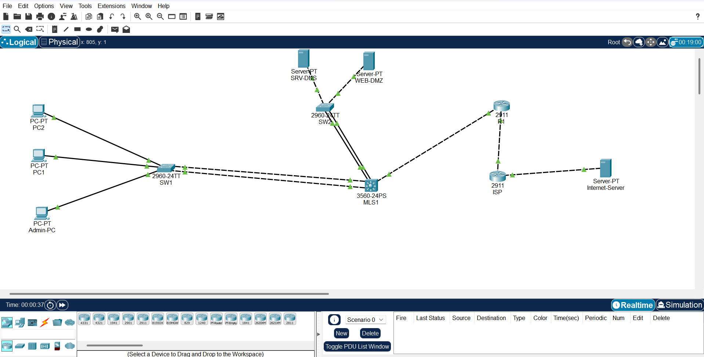

# SecureCorp — Lab réseau d'entreprise (Cisco Packet Tracer)

Conception et configuration complète du réseau d'une PME fictive, avec une
démarche d'architecte : segmentation, routage, redondance et sécurité.

📄 Documentation complète : [Description_Projet_SecureCorp.pdf](Description_Projet_SecureCorp.pdf)

## Architecture

- Modèle hiérarchique : 1 switch cœur L3 (Catalyst 3560), 2 switchs d'accès (Catalyst 2960)
- 4 VLAN : Management (10), Serveurs (20), Utilisateurs (30), DMZ (40)
- Routage inter-VLAN par SVI sur le switch L3
- Agrégation de liens EtherChannel entre accès et cœur (redondance + débit)
- Routage dynamique OSPF entre le cœur et le routeur de bordure
- Sortie Internet via NAT/PAT sur le routeur de bordure
- DHCP centralisé pour le VLAN Utilisateurs, DNS interne dans le VLAN Serveurs

## Sécurité

- ACL appliquant une matrice de flux : les utilisateurs accèdent au DNS,
  à l'intranet DMZ et à Internet, mais pas au VLAN Management
- La DMZ ne peut initier aucune connexion vers le réseau interne
- Administration en SSH uniquement (Telnet désactivé)
- Port security et BPDU Guard sur les ports d'accès
- VLAN natif dédié (999), ports inutilisés désactivés

## Tests de validation

| Test | Résultat attendu |
|---|---|
| DHCP sur PC1/PC2 | Adresse en 10.10.30.x |
| PC1 → DNS (10.10.20.10) | OK |
| PC1 → Management (10.10.10.1) | Bloqué (ACL) |
| PC1 → Internet (8.8.8.8) | OK via NAT |
| PC1 → www.securecorp.lab | Page intranet DMZ |
| DMZ → réseau interne | Bloqué (ACL) |
| SSH vers le cœur | OK / Telnet refusé |

## Utilisation

Ouvrir `SecureCorp_Lab.pkt` avec Cisco Packet Tracer 8.2 ou plus récent.
Identifiants des équipements : admin / Str0ngP@ss (enable : Str0ngEn@ble).

## Auteur

Pascal Amouzoun 
[LinkedIn](https://www.linkedin.com/in/pascal-amouzoun-0a59b5237)
